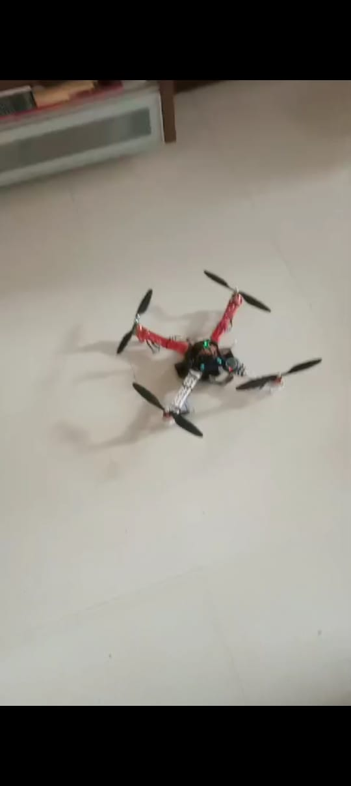
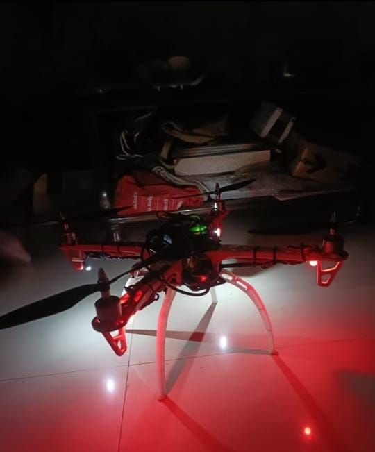

# 🚁 FPV Night Patrolling Quadcopter Drone

<p align="center">
  <strong>A Drone-Based System for Night-Time Monitoring and Patrolling</strong>
</p>

<p align="center">
  
</p>

---

## 📌 About the Project

The **FPV Night Patrolling Quadcopter Drone** is an academic drone project developed for **night-time monitoring, aerial observation, and patrolling applications**.

The system combines a quadcopter platform with an **APM 2.8 flight controller, Raspberry Pi 3, GPS, ultrasonic sensor, camera, LED/IR illumination, telemetry, and wireless communication**.

The main objective is to provide a drone platform capable of operating in low-light conditions while transmitting useful flight and camera information for ground monitoring.

This project demonstrates the integration of:

**Drone Technology + Embedded Systems + Raspberry Pi + GPS + Sensors + Wireless Communication + Night Vision**

---

## 🎯 Objectives

- To develop a quadcopter suitable for night-time monitoring.
- To provide camera-based observation in low-light conditions.
- To integrate a Raspberry Pi 3 with the drone system.
- To use GPS for positioning and navigation.
- To use an ultrasonic sensor for distance/height measurement.
- To integrate LED/IR illumination for improved night visibility.
- To provide telemetry and wireless communication with the ground station.
- To study the possibility of integrating computer vision and object detection.
- To provide a platform for future autonomous patrolling applications.

---

## ⭐ Key Features

- F450-type quadcopter frame
- APM 2.8 flight controller
- Four brushless motors
- 30A ESCs
- 10×4.5 inch propellers
- 11.1V LiPo battery
- Raspberry Pi 3
- GPS module
- Ultrasonic distance sensor
- USB night-vision camera
- IR/LED illumination
- Telemetry communication
- Wi-Fi/4G connectivity
- Mission Planner ground-station support
- ArduPilot flight-control software

---

## 🖼️ Project Images

### ☀️ Drone – Day View

<p align="center">
  
</p>

### 🌙 Drone – Night View

<p align="center">
  
</p>

---

# ⚙️ System Architecture

```text
                       ┌──────────────────┐
                       │   11.1V LiPo     │
                       │     Battery      │
                       └────────┬─────────┘
                                │
                                ▼
                       ┌──────────────────┐
                       │ Power Distribution│
                       │      Board       │
                       └────────┬─────────┘
                                │
              ┌─────────────────┼─────────────────┐
              │                 │                 │
              ▼                 ▼                 ▼
        ┌──────────┐      ┌────────────┐    ┌─────────────┐
        │   ESCs   │      │  APM 2.8   │    │ Raspberry Pi│
        │    ×4    │      │   Flight   │    │      3      │
        └────┬─────┘      │ Controller │    └──────┬──────┘
             │             └─────┬──────┘           │
             ▼                   │          ┌────────┼────────┐
       ┌────────────┐            │          │        │        │
       │ Brushless  │            │          ▼        ▼        ▼
       │ Motors ×4  │            │       Camera    GPS   Ultrasonic
       └────────────┘            │          │
                                 │          ▼
                                 │    Image / Video
                                 │      Processing
                                 │
                                 ▼
                           ┌─────────────┐
                           │  Telemetry  │
                           │ / Wireless  │
                           │Communication│
                           └──────┬──────┘
                                  │
                                  ▼
                           ┌─────────────┐
                           │   Ground    │
                           │   Station   │
                           └─────────────┘
```

---

# 🔧 Hardware Components

| Component | Specification / Purpose |
|---|---|
| Quadcopter Frame | F450-type quadcopter frame |
| Frame Size | Approximately 450 mm |
| Flight Controller | APM 2.8 |
| Motors | ReadyToSky brushless motors, 920KV |
| ESCs | 30A Electronic Speed Controllers |
| Propellers | 10×4.5 inch |
| Battery | 11.1V 3S LiPo |
| Raspberry Pi | Raspberry Pi 3 |
| GPS | GPS module for positioning |
| Camera | USB camera used for night monitoring |
| Night Illumination | IR/LED illumination |
| Ultrasonic Sensor | Distance/height measurement |
| Telemetry | Flight-data communication |
| Wireless Module | Wi-Fi/4G connectivity |

The project documentation specifies an F450-type frame with approximately 450 mm motor-to-motor diagonal, 10×4.5 inch propellers, and a typical 800–1200 g take-off weight depending on the installed battery and payload. :contentReference[oaicite:4]{index=4}

---

# 🛠️ Hardware Description

## 1. F450 Quadcopter Frame

The drone uses an **F450-type quadcopter frame**.

The frame provides the mechanical structure for mounting:

- Motors
- ESCs
- Flight controller
- Raspberry Pi
- GPS
- Camera
- Sensors
- Battery
- Communication modules

The documented frame has a motor-to-motor diagonal of approximately **450 mm**. :contentReference[oaicite:5]{index=5}

---

## 2. Brushless Motors

Four **920KV brushless motors** are used for propulsion.

The motors generate the thrust required for:

- Take-off
- Hovering
- Climbing
- Descending
- Forward/backward movement
- Turning

The four motors rotate in alternating directions to maintain stability. :contentReference[oaicite:6]{index=6}

---

## 3. Electronic Speed Controllers

The **30A ESCs** control the speed of the brushless motors.

The APM 2.8 sends control signals to the ESCs, and the ESCs regulate the power supplied to the motors.

This allows the flight controller to control:

- Roll
- Pitch
- Yaw
- Throttle

---

## 4. Propellers

The project uses **10×4.5 inch propellers**.

The rotating propellers push air downward and generate an upward lifting force, allowing the drone to hover and fly. :contentReference[oaicite:7]{index=7}

---

## 5. APM 2.8 Flight Controller

The **APM 2.8** is the main flight-control unit of the drone.

It processes sensor information and controls the motors through the ESCs.

The controller is used for:

- Flight stabilization
- Sensor processing
- Motor control
- Roll control
- Pitch control
- Yaw control
- Flight modes
- GPS-based functions
- Failsafe functions

The project documentation describes the APM 2.8 as running **ArduPilot** firmware and using sensor data to calculate stabilization corrections. :contentReference[oaicite:8]{index=8}

---

## 6. Raspberry Pi 3

The **Raspberry Pi 3** acts as the onboard computing platform.

It is used for integrating:

- Camera input
- Image processing
- Ultrasonic sensing
- Wireless communication
- Future computer-vision functions

The project documentation also describes communication between the Raspberry Pi and the flight controller through serial/UART or USB connections. :contentReference[oaicite:9]{index=9}

---

## 7. GPS Module

The GPS module provides positioning information by receiving signals from satellites.

GPS information can be used for:

- Position monitoring
- Navigation
- Waypoint-based missions
- Return-to-home functions
- Ground-station monitoring

The project documentation identifies GPS as an important part of positioning and waypoint navigation. :contentReference[oaicite:10]{index=10}

---

## 8. Ultrasonic Sensor

The ultrasonic sensor is used for measuring the distance between the drone and the ground.

It operates by:

1. Sending an ultrasonic pulse.
2. Receiving the reflected echo.
3. Measuring the time taken by the echo.
4. Calculating the distance.

The documented sensor operates around **40 kHz** and is specified for approximately **2–400 cm** sensing, with a maximum range stated as 450 cm. :contentReference[oaicite:11]{index=11}

---

# 🌙 Night Vision System

The drone uses a USB camera together with **IR/LED illumination** for low-light monitoring.

The documented camera configuration is based on a standard USB camera with approximately:

- 1/4 CMOS sensor
- 640×480 resolution
- Infrared illumination

IR LEDs help illuminate the environment so that the camera can capture useful images during low-light conditions. :contentReference[oaicite:12]{index=12}

### Night Vision Pipeline

```text
       Low-Light Environment
                │
                ▼
          IR / LED Light
                │
                ▼
          USB Camera
                │
                ▼
          Raspberry Pi 3
                │
                ▼
       Image Processing
                │
                ▼
        Video / Image Feed
                │
                ▼
        Ground Monitoring
```

---

# 💡 LED / IR Illumination

LED lighting is used to improve visibility during night operation.

The project documentation describes the use of:

- Red LEDs
- Spot LEDs
- IR illumination

These lights provide additional illumination and improve camera visibility in dark environments. :contentReference[oaicite:13]{index=13}

---

# 📡 Communication System

The drone uses telemetry and wireless communication for communication between the drone and the ground station.

```text
                 DRONE
                   │
          ┌────────┴────────┐
          │                 │
          ▼                 ▼
      APM 2.8          Raspberry Pi 3
          │                 │
          ▼                 ▼
      Telemetry          Wi-Fi / 4G
          │                 │
          └────────┬────────┘
                   ▼
             Ground Station
                   │
                   ▼
                Operator
```

The project documentation describes telemetry for flight-data communication and Wi-Fi/4G connectivity for video/data transmission. :contentReference[oaicite:14]{index=14}

---

# 🖥️ Software and Technologies

| Software / Technology | Purpose |
|---|---|
| ArduPilot | Flight-control firmware |
| Mission Planner | Ground control and mission planning |
| Raspberry Pi OS / Raspbian | Raspberry Pi operating system |
| Python | Raspberry Pi programming |
| OpenCV | Image processing |
| TensorFlow Lite | Experimental/future object detection |
| MAVLink | Flight-controller communication |

---

# 🎮 Flight Control

The APM 2.8 receives sensor information and processes it using the flight-control software.

The basic control process is:

```text
Sensors
   │
   ▼
APM 2.8 Flight Controller
   │
   ▼
Flight Control Algorithm
   │
   ▼
PWM Signals
   │
   ▼
ESCs
   │
   ▼
Brushless Motors
   │
   ▼
Drone Movement
```

The flight controller continuously adjusts motor speeds to maintain the required attitude and movement. The project documentation describes PID-based control and PWM outputs to the ESCs. :contentReference[oaicite:15]{index=15}

---

# 🗺️ Mission Planner

**Mission Planner** is used as the ground-control software for the ArduPilot-based flight controller.

It provides functions such as:

- Flight planning
- Waypoint configuration
- Telemetry monitoring
- Sensor calibration
- Parameter configuration
- Firmware management
- Flight-log analysis
- Autonomous mission planning

The project documentation specifically describes Mission Planner as the ground-control station used with APM 2.8. :contentReference[oaicite:16]{index=16}

---

# 🔄 Working Principle

### Step 1 – Power Supply

The 11.1V LiPo battery supplies power to the drone's electronic and propulsion systems.

### Step 2 – Flight Controller

The APM 2.8 receives sensor and control information and manages the flight.

### Step 3 – Motor Control

The APM 2.8 sends signals to the ESCs.

The ESCs regulate the speed of the four brushless motors.

### Step 4 – Flight

The motors rotate the propellers and generate thrust.

Different motor speeds produce roll, pitch and yaw movements.

### Step 5 – GPS

The GPS module provides location information for navigation and monitoring.

### Step 6 – Height Measurement

The ultrasonic sensor measures the distance from the drone toward the ground.

### Step 7 – Night Monitoring

The USB camera captures the surrounding environment.

IR/LED illumination improves visibility in low-light conditions.

### Step 8 – Raspberry Pi Processing

The Raspberry Pi 3 can receive camera/sensor information and perform processing using Python and OpenCV.

### Step 9 – Communication

Telemetry and wireless communication provide data transmission between the drone and the ground station.

### Step 10 – Ground Monitoring

The operator can monitor flight information and the camera/video system from the ground.

---

# 🧠 Computer Vision and Object Detection

The project documentation explores the integration of **TensorFlow Lite and OpenCV** with the Raspberry Pi for object detection.

A possible processing pipeline is:

```text
Camera
   │
   ▼
Image Capture
   │
   ▼
Pre-processing
   │
   ▼
OpenCV
   │
   ▼
TensorFlow Lite Model
   │
   ▼
Object Detection
   │
   ▼
Detection Result
   │
   ▼
Monitoring / Display
```

The black book describes lightweight models such as MobileNet SSD and EfficientDet-Lite and discusses TensorFlow Lite deployment on Raspberry Pi. :contentReference[oaicite:17]{index=17}

### ⚠️ Project Status

**Object detection is treated as an experimental/planned capability in this repository unless demonstrated by the project hardware/software.**

This README therefore does not claim that full autonomous AI-based object detection was successfully implemented on the final prototype.

---

# 🧪 Testing

The project testing process includes:

- Frame and mechanical inspection
- Motor testing
- ESC testing
- ESC calibration
- Flight-controller calibration
- GPS testing
- Ultrasonic sensor testing
- Camera testing
- Night-vision testing
- Telemetry testing
- Wireless communication testing
- Flight stability testing

Before flight, the project documentation recommends checking motor operation, calibrating the IMU/compass/ESCs, and verifying telemetry and GPS status. :contentReference[oaicite:18]{index=18}

---

# 🔧 Calibration

The major calibration steps include:

### Accelerometer / IMU Calibration

The flight controller's accelerometer and related sensors are calibrated using Mission Planner.

### Compass Calibration

The compass is calibrated to improve heading information.

### Radio Calibration

The transmitter channels are calibrated so that the flight controller correctly interprets pilot commands.

### ESC Calibration

The ESC throttle range is calibrated to ensure proper motor response. :contentReference[oaicite:19]{index=19}

---

# 📊 Project Status

| Feature | Status |
|---|---|
| Quadcopter frame | ✅ Implemented |
| Four brushless motors | ✅ Implemented |
| ESC motor control | ✅ Implemented |
| APM 2.8 flight controller | ✅ Implemented |
| Raspberry Pi 3 | ✅ Integrated |
| GPS | ✅ Integrated |
| Ultrasonic sensor | ✅ Integrated |
| Camera monitoring | ✅ Implemented |
| Night illumination | ✅ Implemented |
| Telemetry | ✅ Integrated |
| Mission Planner | ✅ Used for configuration/monitoring |
| Wireless communication | ✅ Implemented/Integrated |
| Advanced AI object detection | 🔬 Experimental / Planned |
| Fully autonomous night patrol | 🚀 Future Scope |
| Thermal imaging | 🚀 Future Scope |
| Automatic object tracking | 🚀 Future Scope |

---

# 🎥 Project Demonstration

## Demonstration Video 1

[▶️ View Drone Demonstration Video 1](videos/drone_demo_video.mp4)

## Demonstration Video 2

[▶️ View Drone Demonstration Video 2](videos/drone_demo_video2.mp4)

---

# 📁 Repository Structure

```text
night-patrolling-drone/
│
├── README.md
│
├── images/
│   ├── drone_day_view.jpg
│   └── drone_night_view.jpg
│
└── videos/
    ├── drone_demo_video.mp4
    └── drone_demo_video2.mp4
```

---

# 🚀 Applications

The developed platform can be considered for authorized applications such as:

- Night-time aerial observation
- Campus monitoring
- Industrial-area monitoring
- Infrastructure inspection
- Wildlife observation
- Disaster-response support
- Search-and-rescue support
- Remote-area observation
- Authorized security monitoring

The project documentation discusses applications including wildlife protection, disaster response and industrial inspection. :contentReference[oaicite:20]{index=20}

---

# 🔮 Future Scope

The project can be further improved by adding:

- Autonomous night patrol routes
- Advanced obstacle avoidance
- AI-based object detection
- Automatic object tracking
- Thermal imaging
- Improved GPS accuracy
- Longer flight duration
- Better low-light cameras
- Improved image stabilization
- Advanced computer vision
- Multi-drone coordination

These improvements are considered future developments rather than confirmed features of the current prototype.

---

# ⚠️ Limitations

The current platform has several practical limitations:

- Raspberry Pi 3 has limited processing capability for heavy AI models.
- IR/LED illumination consumes additional battery power.
- Low-light cameras can produce noise in dark environments.
- Additional sensors and lighting increase payload weight.
- Wireless communication depends on network conditions.
- GPS accuracy can vary with environmental conditions.
- Autonomous AI processing may introduce additional latency.

The project documentation specifically discusses the trade-off between image quality, processing speed, power consumption and Raspberry Pi computational limitations. :contentReference[oaicite:21]{index=21}

---

# 🛡️ Safety and Responsible Use

This project is intended for **educational, academic, research, and authorized monitoring applications**.

Safe operation requires:

- Checking the drone before every flight.
- Verifying battery condition.
- Checking propellers and motors.
- Confirming GPS status.
- Checking telemetry communication.
- Performing appropriate sensor calibration.
- Operating in a suitable and controlled area.
- Following applicable drone and aviation regulations.
- Respecting privacy and avoiding unauthorized surveillance.

The project documentation also describes failsafe functions for conditions such as low battery and communication loss. :contentReference[oaicite:22]{index=22}

---

# 📚 Research Paper

A research paper related to this project is available here:

**DOI:** 10.5281/zenodo.15250212

---

# 👨‍💻 Project Information

| Information | Details |
|---|---|
| Project | FPV Night Patrolling Quadcopter Drone |
| Department | Electronics and Telecommunication Engineering |
| Academic Year | 2024–2025 |
| Institute | Pimpri Chinchwad Polytechnic, Akurdi, Pune |
| Board | Maharashtra State Board of Technical Education (MSBTE) |

The black book identifies the project as a Diploma in Electronics and Telecommunication Engineering project for the 2024–2025 academic year. :contentReference[oaicite:23]{index=23}

---

# 📜 Conclusion

The **FPV Night Patrolling Quadcopter Drone** demonstrates the integration of a quadcopter platform with an **APM 2.8 flight controller, Raspberry Pi 3, GPS, ultrasonic sensing, camera-based monitoring, night illumination, telemetry, and wireless communication**.

The project provides a practical platform for studying drone flight control, embedded systems, low-light monitoring, sensor integration and wireless communication.

The current system also provides a foundation for future development in areas such as **AI-based object detection, autonomous navigation, thermal imaging, automatic tracking and advanced computer vision**.

---

<p align="center">
  <strong>🚁 FPV NIGHT PATROLLING QUADCOPTER DRONE</strong>
</p>
